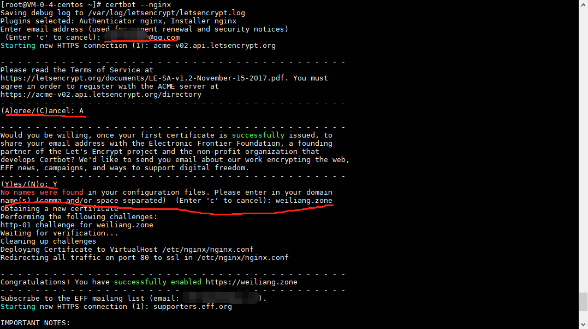

## 自签名证书

> 1.服务端证书生成(单向)
    
    mkdir -p /ssl
    export ssl_generate_version=0.0.1
    curl -L https://github.com/weiliang-ms/ssl/archive/${ssl_generate_version}.tar.gz -O
    tar zxvf ${ssl_generate_version}.tar.gz
    cd ssl-${ssl_generate_version}/shell
    chmod +x *.sh
    cp *.sh /ssl/
    
    # 注意替换参数值
    # ssl-domain为域名
    # ssl-trusted-domain 如果想多个域名访问，则添加扩展域名（SSL_TRUSTED_DOMAIN）,多个扩展域名用逗号隔开；
    # ssl-date 证书有效期（单位:日）
    cd /ssl
    ./server-generate.sh --ssl-domain=www.weiliang.com --ssl-trusted-domain=www.test2.com \
    --ssl-trusted-ip=1.1.1.1,2.2.2.2,3.3.3.3 --ssl-size=2048 --ssl-date=3650
    
> 2.服务端证书生成（可选）

    # ssl-date 证书有效期（单位:日）
    ./client-generate.sh --ssl-date=3650
    
> 3.nginx服务端ssl配置样例

    server {
            listen 8088 ssl;
            ssl_protocols TLSv1.2;
            ssl_prefer_server_ciphers on;
            ssl_session_cache shared:SSL:10m;
            ssl_certificate      /ssl/server/server.crt;  #server证书公钥
            ssl_certificate_key  /ssl/server/server.key;  #server私钥
            ssl_client_certificate /ssl/cacerts.pem;  #根级证书公钥，用于验证各个二级client
            ssl_verify_client on;  #开启客户端证书验证（如非双向认证，不需配置此参数）
            location / {
                    root html;
                    index index.html;
            }
    }
 
> 4.导入客户端证书（可选）

    客户端导入/ssl/client/client.p12文件   
    
## 开源ssl证书

适用场景（必须满足以下条件）：

- 备案域名

- 备案域名绑定公网IP

为了在您的网站上启用 HTTPS，您需要从证书颁发机构（CA）获取证书（一种文件）。
Let’s Encrypt 是一个证书颁发机构（CA）。要从 Let’s Encrypt 获取您网站域名的证书，您必须证明您对域名的实际控制权。
您可以在您的 Web 主机上运行使用 ACME 协议的软件来获取 Let’s Encrypt 证书。

### 自动配置nginx 443 ssl监听

**适用场景：**

- yum方式安装的nginx

> 1.安装epel源

    yum install -y epel-release
    
> 2.安装nginx并运行

    yum install -y nginx
    systemctl enable nginx --now
    
> 3.安装cert bot

     yum install certbot python2-certbot-nginx -y
     
> 4.配置certbot

    certbot --nginx
    
按提示输入：1.邮箱地址 2.A 3.Y 4.宿主机绑定的域名 

> 5.查看nginx配置变化

`cerbot`自动修改`/etc/nginx/nginx.conf`添加 443监听的配置

     server {
        server_name weiliang.zone; # managed by Certbot
        root         /usr/share/nginx/html;
        # Load configuration files for the default server block.
        include /etc/nginx/default.d/*.conf;
        location / {
        }
        error_page 404 /404.html;
            location = /40x.html {
        }
        error_page 500 502 503 504 /50x.html;
            location = /50x.html {
        }
        listen [::]:443 ssl ipv6only=on; # managed by Certbot
        listen 443 ssl; # managed by Certbot
        ssl_certificate /etc/letsencrypt/live/weiliang.zone/fullchain.pem; # managed by Certbot
        ssl_certificate_key /etc/letsencrypt/live/weiliang.zone/privkey.pem; # managed by Certbot
        include /etc/letsencrypt/options-ssl-nginx.conf; # managed by Certbot
        ssl_dhparam /etc/letsencrypt/ssl-dhparams.pem; # managed by Certbot
    }
    server {
        if ($host = weiliang.zone) {
            return 301 https://$host$request_uri;
        } # managed by Certbot
        listen       80 ;
        listen       [::]:80 ;
        server_name weiliang.zone;
        return 404; # managed by Certbot
    }

> 5.配置定时任务

    echo "0 0,12 * * * root python -c 'import random; import time; time.sleep(random.random() * 3600)' && certbot renew -q" | sudo tee -a /etc/crontab > /dev/null

### 手动配置nginx 443 ssl监听

**适用场景：**

- 自定义安装的`nginx`

> 1.安装epel源

    yum install -y epel-release
    
> 2.安装nginx并运行

    export deploy_version=0.0.4
    curl -L https://github.com/weiliang-ms/deploy/archive/${deploy_version}.tar.gz -O
    tar zxvf ${deploy_version}.tar.gz
    cd deploy-${deploy_version}/nginx
    sh install.sh
    
> 3.安装cert bot

     yum install certbot python2-certbot-nginx -y
     
> 4.配置certbot

    certbot --nginx
    
按提示输入：1.邮箱地址 2.A 3.Y 4.宿主机绑定的域名 

> 5.配置定时任务
    
    echo "0 0,12 * * * root python -c 'import random; import time; time.sleep(random.random() * 3600)' && certbot renew -q" | sudo tee -a /etc/crontab > /dev/null

